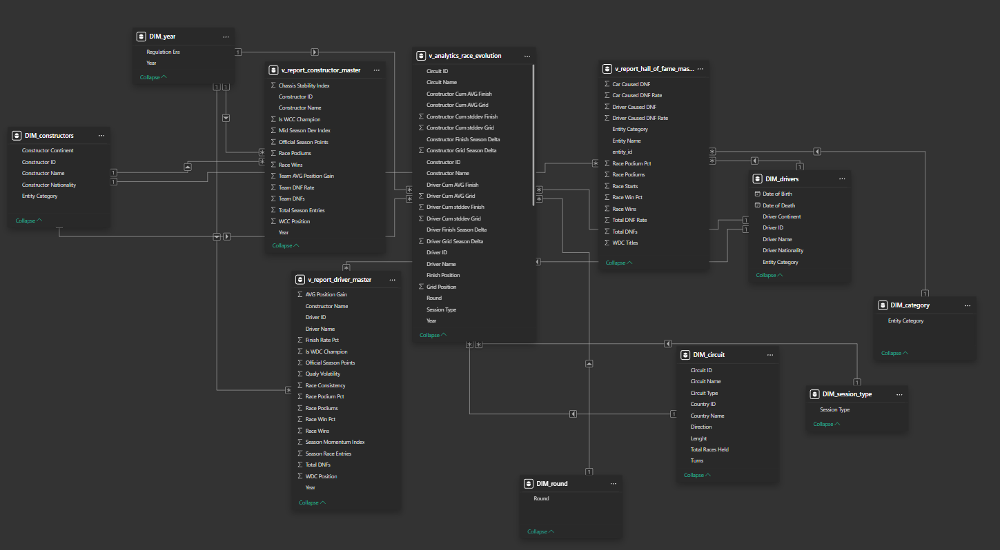
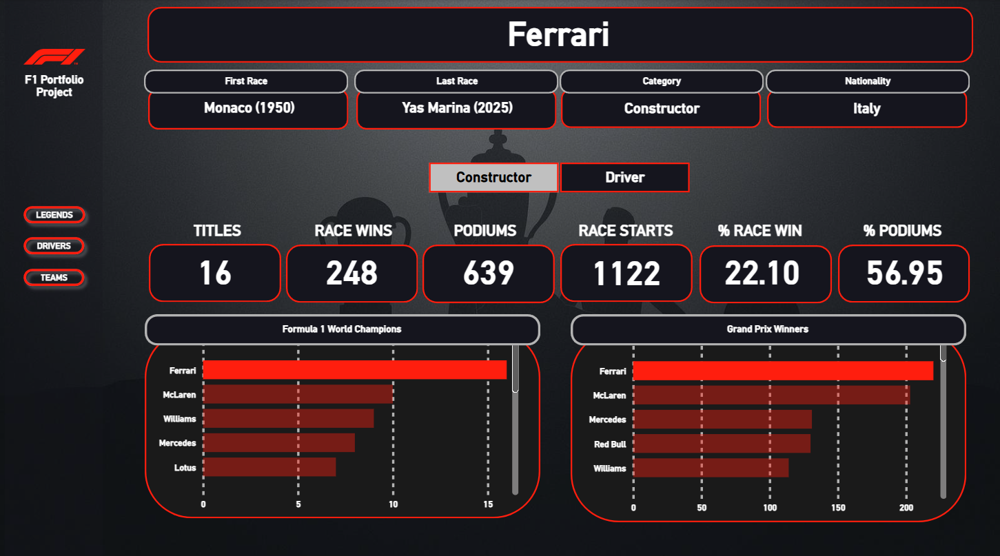
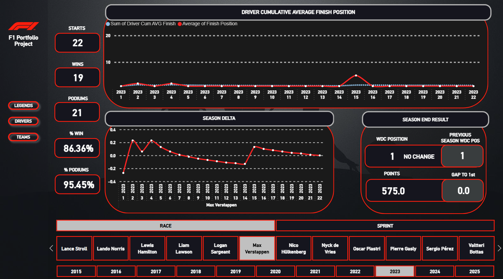
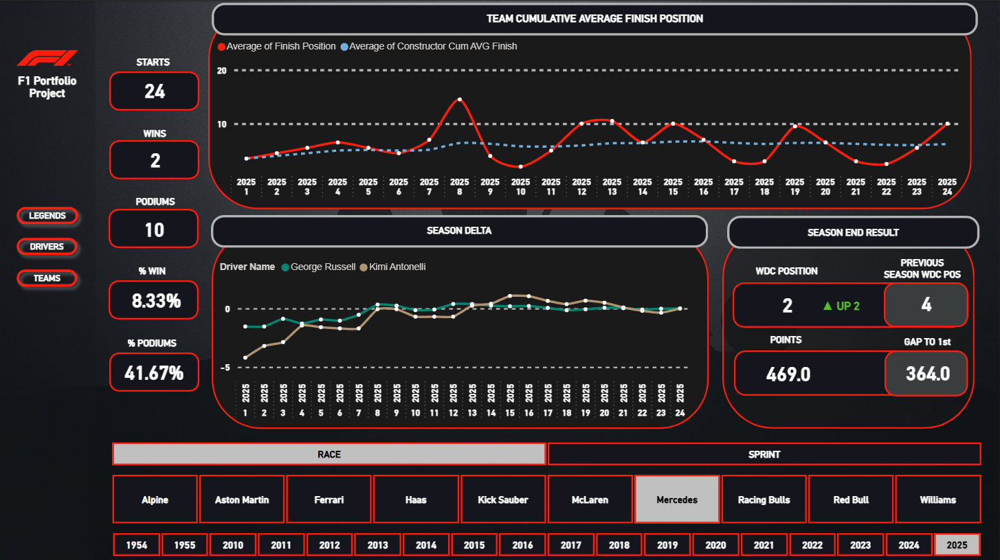

# 📊 Formula 1 Historical Analytics Dashboard — Power BI Portfolio Project

---

## Project Overview

This Power BI project is a comprehensive historical analytics dashboard covering the entire history of Formula 1 racing. It enables end users to explore the careers and seasonal performance of every driver and constructor that has ever competed in a Formula 1 World Championship race, as well as identify the sport's all-time elite — the World Champions and race winners across both categories. The report is structured into three dedicated pages: **LEGENDS**, **DRIVERS**, and **TEAMS**, each serving a distinct analytical purpose with a consistent visual language and navigation experience.

The design language is intentionally dark-themed and brand-aligned, leveraging the official F1 color palette (deep black `#15151E` background, F1 red `#FF1801` accents) and the *Innovate* Power BI theme. Custom background images and the official F1 logo are embedded as registered report resources, creating a polished, publication-ready aesthetic appropriate for a professional portfolio.

---

## 1. Data Import & Source Layer

Data was imported into Power BI from a local database `f1_portfolio_db`, as a 'follow-up' to deliver data visualization to SQL Portfolio Project.

The following views were loaded into the Power BI data model:

| View Name | Role |
|---|---|
| `v_analytics_race_evolution` | Core fact/analytics view — race-by-race results enabling running totals and averages |
| `v_report_driver_master` | Season-level aggregated driver statistics (WDC position, season points) |
| `v_report_constructor_master` | Season-level aggregated constructor statistics (WCC position, season points) |
| `v_report_hall_of_fame_master` | Career-aggregated statistics for drivers and constructors who won at least one race |

All views were loaded in **Import** mode, meaning data is cached inside the Power BI model for optimal query performance.

---

## 2. Data Model — Star Schema Design

The data model follows a **star schema** architecture, organized around a central fact/analytics view surrounded by dedicated dimension tables. This structure ensures clean, unambiguous relationships, minimizes DAX complexity, and optimizes filter propagation across visuals.

### Dimension Tables (DIM)

Five dimension tables were created to serve as lookup and filter contexts:

| Table | Key Column | Purpose |
|---|---|---|
| `DIM_drivers` | `Driver Name` | Master list of all F1 drivers; drives the driver slicer on the DRIVERS page |
| `DIM_constructors` | `Constructor Name` | Master list of all F1 constructors; drives the team slicer on the TEAMS page |
| `DIM_year` | `Year` | Calendar year dimension; enables year-level filtering across all pages |
| `DIM_round` | `Round` | Race round number within a season; enables round-level drill-through on line charts |
| `DIM_session_type` | `Session Type` | Session type classification (e.g., race); allows filtering by session context |
| `DIM_category` | `Entity Category` | Categorical dimension distinguishing between "Driver" and "Constructor" entities; used exclusively on the LEGENDS page for the entity-type slicer |
| `DIM_circuit` | *(circuit key)* | Circuit dimension; loaded into the model for potential geographical context |

### Fact / Analytics Views (connected to DIM tables)

The central analytics view `v_analytics_race_evolution` acts as the primary fact table in the star schema. It stores granular, race-level records and is connected to the dimension tables via the following relationships:

- `DIM_drivers[Driver Name]` → `v_analytics_race_evolution` *(one-to-many)*
- `DIM_constructors[Constructor Name]` → `v_analytics_race_evolution` *(one-to-many)*
- `DIM_year[Year]` → `v_analytics_race_evolution` *(one-to-many)*
- `DIM_round[Round]` → `v_analytics_race_evolution` *(one-to-many)*
- `DIM_session_type[Session Type]` → `v_analytics_race_evolution` *(one-to-many)*

The report-level master views (`v_report_driver_master`, `v_report_constructor_master`, `v_report_hall_of_fame_master`) operate at a higher granularity (season or career level) and are used for terminal KPI cards showing final season outcomes, decoupled from the round-level filtering of the analytics view.

This separation of granularity — race-level facts for evolution tracking, season-level views for final standings — is a deliberate design choice that prevents incorrect aggregation and ensures each visual queries the most appropriate data grain.

---

## 3. Measure Architecture

All business logic is implemented as **DAX measures** organized into dedicated measure tables, keeping the model clean and measures easily discoverable:

- **`_Legends Measures`** — Context-specific measures for the LEGENDS page:
  - `Dynamic Nationality` — dynamically returns the nationality of the selected entity
  - `Entity Name` — returns the display name of the currently selected Legend
  - `Category` — returns whether the selected entity is a Driver or Constructor
  - `First Race Display` — formats and returns the first race appearance
  - `Last Race Display` — formats and returns the most recent race appearance

- **Inline measures on `v_analytics_race_evolution`** — The bulk of analytical computation lives here, including:
  - `_Dynamic Driver Wins` / `_Dynamic Team Wins` — context-aware win count (respects all active slicer filters)
  - `_Dynamic Driver Podium` / `_Dynamic Team Podium` — context-aware podium count
  - `_Dynamic Driver Race Starts` / `_Dynamic Team Race Starts` — total race starts under current filter context
  - `_Win % Driver` / `_Win % Team` — win rate percentage (wins / starts)
  - `_Podium % Driver` / `_Podium % Team` — podium rate percentage
  - `_Gap to Leader Driver` / `_Gap to Leader Team` — points gap to the championship leader in the selected season
  - `_Prev Year WDC Pos Driver` / `_Prev Year WCC Pos Team` — prior season's final championship position, used as a comparison baseline
  - `_WDC YoY Diff Driver` / `_WCC YoY Diff Team` — Year-over-Year change in championship position, rendered as a directional indicator (e.g., **▲ UP 2** or **▼ DOWN 3**)

---

## 4. Report Pages

### Page 1 — LEGENDS

**Purpose:** The LEGENDS page is a Hall of Fame–style showcase, displaying aggregated career statistics for every Formula 1 driver and constructor who has ever won a race (i.e., at minimum one race win) or secured a World Championship title. It is designed to answer questions like *"Who are the greatest champions in F1 history, and how do their career numbers compare?"*

**Interactivity:**

A slicer connected to `DIM_category[Entity Category]` allows the user to toggle between two views:
- **Driver** — World Drivers' Champions and race-winning drivers
- **Constructor** — World Constructors' Champions and race-winning teams

**Profile Panel (left side):**
Upon selecting an entity from the bar charts, a dynamic profile panel updates to display:
- **Entity Name** (via `_Legends Measures.Entity Name`)
- **Category** (Driver or Constructor)
- **Nationality** (via `_Measures.Dynamic Nationality`)
- **First Race** (via `_Measures.First Race Display`)
- **Last Race** (via `_Measures.Last Race Display`)

**KPI Cards:**
Six summary cards present career-level statistics aggregated from `v_report_hall_of_fame_master`:
- World Championship Titles (WDC Titles)
- Race Wins
- Race Win Percentage
- Podiums
- Podium Percentage
- Race Starts

**Charts:**
Two horizontal **clustered bar charts** provide a comparative ranking view:
1. Entities ranked by **World Championship Titles** (Y-axis: `Entity Name`, X-axis: `Sum(WDC Titles)`)
2. Entities ranked by **Race Wins** (Y-axis: `Entity Name`, X-axis: `Sum(Race Wins)`)

Both charts act as interactive selectors — clicking on a bar updates the profile panel with that entity's details.

---

### Page 2 — DRIVERS

**Purpose:** The DRIVERS page provides a full seasonal breakdown for any Formula 1 driver who has ever started a race. It enables the user to track a driver's in-season performance trajectory round by round, review their final championship outcome, and compare it against the prior season. It answers questions like *"How did this driver progress through the 2023 season? Did they improve or decline relative to the previous year?"*

**Slicers (Filters):**
- **Year** (`DIM_year[Year]`) — selects the season to analyze
- **Session Type** (`DIM_session_type[Session Type]`) — filters by session classification
- **Driver** (`DIM_drivers[Driver Name]`) — selects the individual driver to profile

**KPI Cards:**
Five performance cards update dynamically based on slicer context (sourced from `v_analytics_race_evolution`):
- Total Race Starts
- Total Wins
- Win Percentage
- Total Podiums
- Podium Percentage

**Season-End Results Panel:**
A dedicated panel displays the final standings outcome for the selected driver in the selected season, sourced from `v_report_driver_master` (season-level grain):
- **WDC Final Position** — the driver's finishing position in the World Drivers' Championship
- **Previous Year WDC Position** — the prior season's final position for comparison
- **YoY Position Change** — a formatted directional indicator (e.g., *▲ UP 2* or *▼ DOWN 2*) computed via `_WDC YoY Diff`
- **Official Season Points** — the driver's total points for the season
- **Gap to Leader** — points deficit to the championship leader (`_Gap to Leader`)

**Line Charts (In-Season Evolution):**
Two line charts enable round-by-round tracking of the driver's performance trajectory within the selected season, using `DIM_round[Round]` and `DIM_year[Year]` on the category axis:

1. **Running Total / Cumulative Average** — plots `Driver Cum AVG Finish` (cumulative average finish position) and `Finish Position` (race-by-race result count) across rounds. Selecting a specific round on this chart acts as a drill-filter, allowing the user to narrow the KPI cards to that point in the season — effectively creating a *"season up to round N"* view.

2. **Season Delta Chart** (`Driver Finish Season Delta`) — tracks the delta in performance metrics round over round, providing a visual signal of momentum shifts across the season.

**Navigation:**
Three action buttons in the header (LEGENDS / DRIVERS / TEAMS) provide page-level navigation across the report.

---

### Page 3 — TEAMS

**Purpose:** The TEAMS page mirrors the DRIVERS page in structure and functionality, but targets **Formula 1 constructors** rather than individual drivers. It enables analysis of any team's seasonal performance trajectory and championship outcome across any year in F1 history. It answers questions like *"How did this constructor develop over the 2022 season, and how did their final standing compare to the prior year?"*

**Slicers (Filters):**
- **Year** (`DIM_year[Year]`)
- **Session Type** (`DIM_session_type[Session Type]`)
- **Constructor** (`DIM_constructors[Constructor Name]`)

**KPI Cards:**
Five performance cards sourced from `v_analytics_race_evolution`, team-specific variants:
- Total Race Starts
- Total Wins (team)
- Win Percentage (team)
- Total Podiums (team)
- Podium Percentage (team)

**Season-End Results Panel:**
Mirrors the driver equivalent, but sourced from `v_report_constructor_master`:
- **WCC Final Position** — the constructor's final World Constructors' Championship standing
- **Previous Year WCC Position** — prior season comparison baseline
- **YoY Position Change** — directional indicator via `_WDC YoY Diff Team` (e.g., *▼ DOWN 2*)
- **Official Season Points** — total constructor points for the season
- **Gap to Leader** — points deficit to the WCC leader (`_Gap to Leader Team`)

**Line Charts (In-Season Evolution):**
Two line charts using `DIM_round[Round]` and `DIM_year[Year]` on the category axis:

1. **Running Total / Cumulative Average** — plots `Constructor Cum AVG Finish` and `Finish Position` count across rounds. As with the DRIVERS page, selecting a round filters the entire page context to *"season up to round N"*, enabling progressive performance review.

2. **Season Delta Chart** (`Driver Finish Season Delta`) — round-over-round delta tracking for the selected constructor, with `DIM_drivers[Driver Name]` used as a series dimension, enabling per-driver breakdown within the team's seasonal delta view.

**Navigation:**
Identical three-button navigation header as on the DRIVERS page.

---

## 5. Technical & Design Highlights

- **F1 Brand Theming:** The report uses a fully custom dark theme (`#15151E` base, `#FF1801` F1 red accents) applied via the *Innovate* built-in theme combined with the current Power BI baseline theme (`CY26SU02`). The official F1 logo and a custom hero background image are embedded as registered report resources, giving the dashboard a premium, brand-consistent appearance.

- **YoY Comparison Logic:** Year-over-Year position change is computed dynamically in DAX by comparing the current season's final position against the prior year's equivalent metric. The result is formatted as a human-readable directional string (e.g., *▲ UP 2*, *▼ DOWN 3*, *— NO CHANGE*), providing immediate, scannable insight without requiring the user to mentally subtract values.

- **Dual-Granularity Architecture:** The deliberate use of separate data sources for race-level evolution (`v_analytics_race_evolution`) and season-level final standings (`v_report_driver_master`, `v_report_constructor_master`) prevents aggregation errors that would occur if a single table were used across both contexts. This is a fundamental data modeling consideration that ensures KPI cards always reflect the correct grain.

- **Interactive Round Selection:** The line charts on the DRIVERS and TEAMS pages are configured to act as cross-filters. Clicking on a specific round in the chart narrows all KPI cards to reflect only the races up to and including that round — effectively turning a static KPI panel into an animated season replay tool.

- **Scalability:** Because the data layer is entirely view-based, the report can be refreshed and extended simply by updating the underlying database views, with zero changes required to the Power BI model or report layout.

---
